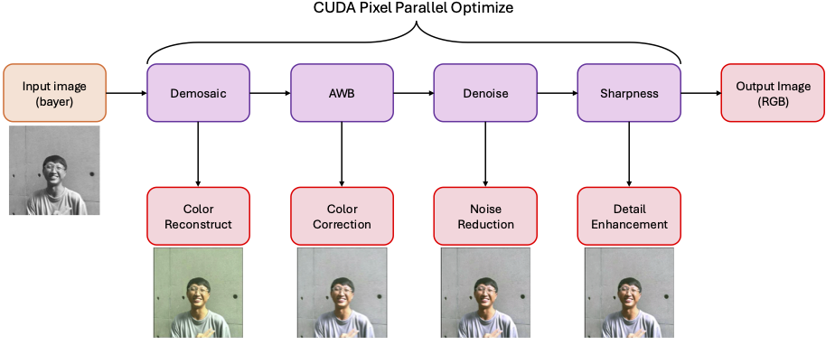
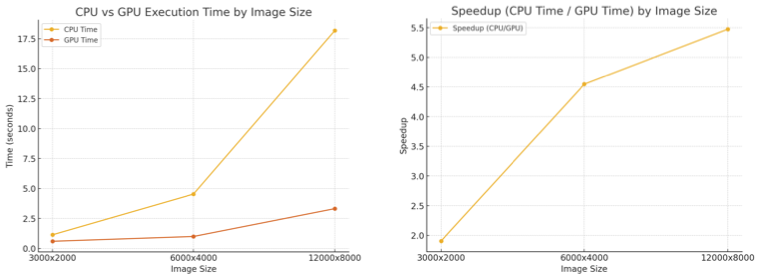

# CUDA-ISP


CUDA-ISP (Image Signal Processing) is a high-performance image processing pipeline designed for CUDA-enabled GPUs. This repository provides a flexible framework for performing various image processing tasks, such as degradation, CPU-based processing, and GPU-accelerated processing.

---

## Features

- **Degradation Simulation**: Generate degraded images from input PNG files.
- **CPU-Based Image Processing**: Reference implementation of the processing pipeline on the CPU.
- **GPU-Accelerated Image Processing**: High-performance implementation of the pipeline using CUDA.

---

## Requirements

- CUDA-enabled GPU
- NVIDIA CUDA Toolkit
- A C++ compiler supporting C++11
- Linux-based operating system (tested on Ubuntu)

---

## Compilation

### Build Instructions

1. Clean any existing build artifacts:
   ```bash
   make clean
   ```
2. Compile the project:
   ```bash
   make
   ```

The resulting executable will be named `cuda-isp`.

---

## Usage

### Command Format

```bash
./cuda-isp <input_image> <output_image> <mode>
```

- **`<input_image>`**: Path to the input image.
- **`<output_image>`**: Path to the output image.
- **`<mode>`**: Processing mode:
  - `degrad`: Degradation simulation.
  - `cpu`: CPU-based processing.
  - `gpu`: GPU-accelerated processing.

### Example Execution Script

The `ex_single.sh` script demonstrates how to use the tool for various image sizes:

```bash
make clean
make
mkdir -p output/

./cuda-isp images/test_3000x2000.png images/test_raw_3000x2000.bmp degrad
./cuda-isp images/test_raw_3000x2000.bmp output/output_cpu_3000x2000.bmp cpu
./cuda-isp images/test_raw_3000x2000.bmp output/output_gpu_3000x2000.bmp gpu

./cuda-isp images/test_6000x4000.png images/test_raw_6000x4000.bmp degrad
./cuda-isp images/test_raw_6000x4000.bmp output/output_cpu_6000x4000.bmp cpu
./cuda-isp images/test_raw_6000x4000.bmp output/output_gpu_6000x4000.bmp gpu

./cuda-isp images/test_12000x8000.png images/test_raw_12000x8000.bmp degrad
./cuda-isp images/test_raw_12000x8000.bmp output/output_cpu_12000x8000.bmp cpu
./cuda-isp images/test_raw_12000x8000.bmp output/output_gpu_12000x8000.bmp gpu
```

---

## Folder Structure

```
.
├── filters/         # Custom image processing filters
├── stb_image/       # Dependency for image loading and saving
├── images/          # Example input images
├── output/          # Generated output images
├── main.cu          # Main CUDA implementation
├── Makefile         # Build script
├── ex_single.sh     # Example usage script
└── README.md        # Project documentation
```

---

## Performance




This framework leverages CUDA to accelerate image processing tasks, achieving significant speed-ups compared to CPU-based processing. GPU implementations are particularly effective for high-resolution images (e.g., 6000x4000 or larger).
